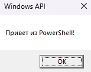

# Взаимодействие с Windows API с помощью PowerShell

## 1. Введение {#introduction}

[Содержание раздела]

---

## 2. Архитектура взаимодействия {#architecture}

### 2.1. Принцип работы P/Invoke {#pinvoke-principle}

[Содержание раздела]

### 2.2. Жизненный цикл P/Invoke вызова {#pinvoke-lifecycle}

[Содержание раздела]

### 2.3. Командлет Add-Type {#add-type}

[Содержание раздела]

### 2.4. Альтернативные способы взаимодействия {#alternatives}

[Содержание раздела]

### 2.5. Ограничения {#limitations}

[Содержание раздела]

---

## 3. Предварительные требования {#prerequisites}

[Содержание раздела]

---

## 4. Базовый синтаксис импорта API {#import-syntax}

Для вызова функций из нативных библиотек Windows (kernel32.dll, user32.dll и др.) в PowerShell используется механизм [Platform Invoke](#pinvoke-principle).  
Это стандартный способ взаимодействия управляемого кода .NET с неуправляемыми функциями Windows API.  
Подробнее о принципах и отличиях в разных версиях PowerShell см. [Архитектура взаимодействия](#architecture).

Для реализации P/Invoke используется атрибут **DllImport**.
Он указывает среде выполнения, из какого именно .dll-файла и какую функцию нужно вызвать.  
Подробное описание параметров атрибута приведено в подразделе [Атрибут DllImport](#dllimport-attribute).

Чтобы применить этот атрибут в PowerShell, используется [командлет Add-Type](#add-type).  
Он компилирует фрагмент C#-кода с [атрибутом DllImport](#dllimport-attribute) и добавляет полученный тип в текущую сессию PowerShell.  
Типичный шаблон использования показан в подразделе [Шаблон импорта с помощью Add-Type](#add-type-template).

### 4.1. Атрибут DllImport {#dllimport-attribute}

Атрибут DllImport — это ключевой элемент [Platform Invoke](#pinvoke-principle), который сообщает среде Common Language Runtime (CLR), какую неуправляемую библиотеку (DLL) загрузить и какую функцию в ней вызвать.
Этот атрибут применяется к статическому внешнему методу и содержит всю необходимую информацию для [маршаллинга данных](#marshalling).

Атрибут имеет следующие параметры:

| Параметр                    | Описание                                                                                                                                                                                                                                                              | Значение по умолчанию      |
| -----------------------------| -----------------------------------------------------------------------------------------------------------------------------------------------------------------------------------------------------------------------------------------------------------------------| ----------------------------|
| **dll-name** (обязательный) | Имя библиотеки                                                                                                                                                                                                                                                        | —                          |
| **EntryPoint**              | Имя функции, если хотите переименовать импортируемую C#-функцию                                                                                                                                                                                                       | —                          |
| **CharSet**                 | Кодировка строк. Может принимать значения `CharSet.Auto`, `CharSet.Unicode` и `CharSet.Ansi`                                                                                                                                                                          | `CharSet.Auto`             |
| **SetLastError**            | `true`, если функция сохраняет информацию об ошибках. См. [Получение кода ошибок](#error-codes)                                                                                                                                                                       | `false`                    |
| **ExactSpelling**           | `true`, если значение параметра **EntryPoint** должно совпадать с именем функции. `false`, если используются эвристики сопоставления имён                                                                                                                             | `false`                    |
| **PreserveSig**             | `true`, если нужно сохранить оригинальную сигнатуру функции (возвращаемое значение HRESULT передаётся как `int`). `false`, если среда выполнения должна автоматически преобразовывать неудачные HRESULT в исключения. См. [Обработка исключений](#exception-handling) | `true`                     |
| **CallingConvention**       | Соглашение о вызовах, определяющее порядок передачи аргументов и очистки стека.                                                                                                                                                                                       | `CallingConvention.Winapi` |

Значения **CallingConvention**:

| Значение   | Описание                                                                                                              |
| ---------- | --------------------------------------------------------------------------------------------------------------------- |
| `Winapi`   | Использует соглашение платформы по умолчанию. На Windows эквивалентно `StdCall`                                       |
| `Cdecl`    | Вызывающий код очищает стек. Применяется для функций с переменным числом аргументов (например, `printf`)              |
| `StdCall`  | Вызываемая функция очищает стек. Стандартное соглашение для Win32 API                                                 |
| `ThisCall` | Первый параметр — указатель `this` (через регистр ECX). Используется для вызовов методов классов из неуправляемых DLL |
| `FastCall` | Аргументы по возможности передаются через регистры. В .NET не поддерживается                                          |

Пример атрибута c заданными параметрами:

```csharp
[DllImport("user32.dll",
    EntryPoint = "MessageBoxW",
    CharSet = CharSet.Unicode,
    SetLastError = true,
    ExactSpelling = true,
    PreserveSig = true,
    CallingConvention = CallingConvention.Winapi)]
```

### 4.2. Шаблон импорта c помощью Add-Type {#add-type-template}

Importing Windows API functions in PowerShell is performed using the `Add-Type` cmdlet, which compiles C# code on the fly and loads the resulting type into the current session.

As an example, we use the `DllImport` attribute with the parameters described in the [previous subsection](#dllimport-attribute) to import the `MessageBoxW` function.

`MessageBoxW` is a Windows API function that displays a modal dialog box containing a message and buttons, and returns a value indicating which button the user pressed.

Step-by-step Example:

1. Define the function signature for `MessageBoxW` according to the [Windows API documentation](https://learn.microsoft.com/en-us/windows/win32/api/winuser/nf-winuser-messageboxw):

  ```powershell
  $signature = @'
  [DllImport("user32.dll", EntryPoint = "MessageBoxW", CharSet = CharSet.Unicode, SetLastError = true, ExactSpelling = true, PreserveSig = true, CallingConvention = CallingConvention.Winapi)]
  // Parameters:
  //   hWnd      - handle to the parent window (0 = no parent)
  //   lpText    - message text
  //   lpCaption - window title
  //   uType     - type of buttons and icons
  public static extern int MessageBox(IntPtr hWnd, string lpText, string lpCaption, uint uType);
  '@
  ```
  
  **Note**: The combination of `public static extern` in P/Invoke ensures that the method is accessible from PowerShell (`public`), can be called without creating an instance of the class (`static`), and `extern` indicates that the method implementation resides outside managed code — in a native DLL, from which the CLR substitutes the actual call code at runtime. Omitting any of these key modifiers makes correct import and invocation of the Windows API function from PowerShell impossible.

2. Import the API using `Add-Type`:

  ```powershell
  $type = Add-Type -MemberDefinition $signature -Name "User32API" -Namespace "Win32" -PassThru
  ```
  
  For the list of `Add-Type` parameters, refer to the subsection [Add-Type Parameters](#add-type-parameters).

3. Invoke the imported function:

  ```powershell
  $result = $type::MessageBox([IntPtr]::Zero, "Hello World!", "Windows API", 0)
  ```

4. Upon successful execution, the following dialog box will appear. Click the "OK" button for the function to return the value corresponding to the pressed button:

  

5. Display the result:

  ```powershell
  Write-Host "Function call result: $result"
  ```

### 4.3. Параметры Add-Type {#add-type-parameters}

When importing Windows API functions, the most commonly used `Add-Type` parameters are listed below:

| Parameter                       | Purpose                                                                                | Example Value                      |
| ------------------------------- | -------------------------------------------------------------------------------------- | ---------------------------------- |
| `-MemberDefinition` (mandatory) | String containing the C# code (including the `[DllImport]` attribute)                 | `$signature` (here-string)         |
| `-Name` (mandatory)             | Name of the generated type or class                                                    | `"Win32Utils"`, `"NativeMethods"`  |
| `-Namespace`                    | Namespace to prevent name conflicts with other types                                   | `"Win32"`, `"PInvoke"`, `"Native"` |
| `-PassThru`                     | Returns the created type as an object (allows immediate assignment to a variable)      | `$type = Add-Type ... -PassThru`   |
| `-ReferencedAssemblies`         | Additional .NET assemblies required by the code (e.g. for Windows Forms)              | `"System.Windows.Forms"`           |
| `-IgnoreLastError`              | Disables automatic capturing of `GetLastError()` (not recommended for Win32 API calls) | —                                  |

Examples of their usage are listed below:

#### `-MemberDefinition` paremeter

The `-MemberDefinition` parameter is the most important one — it accepts the actual C# declaration of the imported function(s). It is usually provided as a here-string for readability.

```powershell
# Define the function signature
$signature = @'
[DllImport("user32.dll", CharSet = CharSet.Unicode, SetLastError = true)]
public static extern int MessageBoxW(
    IntPtr hWnd,
    string lpText,
    string lpCaption,
    uint uType
);
'@

# Use -MemberDefinition to pass the signature
$type = Add-Type -MemberDefinition $signature `
                 -Name "User32Methods" `
                 -Namespace "Win32" `
                 -PassThru

# Now we can call the function
$result = $type::MessageBoxW(
    [IntPtr]::Zero,
    "This is a test message",
    "PowerShell + WinAPI",
    0x40  # MB_ICONINFORMATION
)

Write-Host "Dialog result: $result"
```

#### `-Name` paremeter

....

---

## 5. Маршаллинг данных {#marshalling}

### 5.1. Общие принципы {#marshalling-principles}

[Содержание раздела]

### 5.2. Простые типы {#simple-types}

[Содержание раздела]

### 5.3. Строковые типы {#string-types}

[Содержание раздела]

### 5.4. Указатели {#pointers}

[Содержание раздела]

### 5.5. Структуры {#structures}

[Содержание раздела]

### 5.6. Массивы {#arrays}

[Содержание раздела]

### 5.7. Callback-функции (делегаты) {#callbacks}

[Содержание раздела]

### 5.8. Оптимизация маршаллинга {#marshalling-optimization}

[Содержание раздела]

---

## 6. Отладка и диагностика {#debugging}

### 6.1. Программная отладка {#software-debugging}

#### 6.1.1. Получение кода ошибок {#error-codes}

[Содержание раздела]

#### 6.1.2. Обработка исключений {#exception-handling}

[Содержание раздела]

### 6.2. Инструментальная отладка {#instrumental-debugging}

#### 6.2.1. Проверка экспортов DLL {#dll-exports}

[Содержание раздела]

#### 6.2.2. Проверка размеров структур {#structure-size}

[Содержание раздела]

---

## 7. Практические примеры {#examples}

### 7.1. Окна {#windows-examples}

[Содержание раздела]

### 7.2. Процессы и память {#process-memory-examples}

[Содержание раздела]

### 7.3. Системная информация {#system-info-examples}

[Содержание раздела]

### 7.4. Управление питанием {#power-management-examples}

[Содержание раздела]

---

## 8. Лучшие практики {#best-practices}

### 8.1. Создание модуля-обертки {#wrapper-module}

[Содержание раздела]

### 8.2. Кэширование типов {#type-caching}

[Содержание раздела]

### 8.3. Улучшение производительности {#performance}

[Содержание раздела]

---

## 9. Безопасность {#security}

### 9.1. Политики выполнения скриптов {#execution-policies}

[Содержание раздела]

### 9.2. Конфиденциальность данных {#data-privacy}

[Содержание раздела]

---

## 10. Распространённые ошибки {#common-errors}

### 10.1. EntryPointNotFound {#entrypointnotfound}

[Содержание раздела]

### 10.2. DllNotFound {#dllnotfound}

[Содержание раздела]

### 10.3. AccessViolation {#accessviolation}

[Содержание раздела]

---

## 11. Полезные ссылки {#links}

[Содержание раздела]
